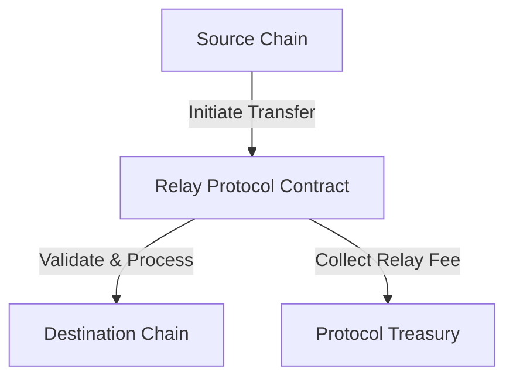
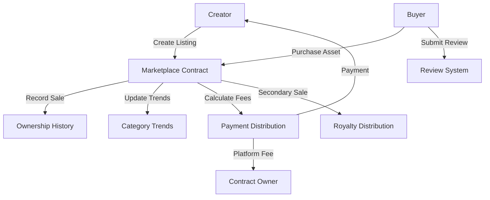

# # Relay BIP: Cross-Chain Token Relay Protocol

## Overview

Relay BIP is a decentralized cross-chain relay mechanism designed to facilitate secure and efficient token transfers across multiple blockchain networks. By implementing a robust, transparent, and fee-based relay system, this protocol enables seamless asset movement while maintaining high security standards.

## Problem Statement

Existing cross-chain transfer solutions often suffer from:
- High friction in asset transfers
- Lack of transparent fee mechanisms
- Limited support for multiple blockchain networks
- Complex integration processes

## Key Features

🔄 **Multi-Chain Support**
- Configure and support multiple blockchain networks
- Flexible relay transaction management
- Configurable transfer limits per chain

💰 **Transparent Fee Structure**
- Low, predictable relay fees (2% per transaction)
- Fee distribution to protocol maintainers
- No hidden costs

🔒 **Enhanced Security**
- Proof-based verification for relay transactions
- Owner-controlled chain configuration
- Comprehensive transaction tracking

## Architecture



## Getting Started

### Prerequisites
- Clarinet
- Stacks wallet
- Basic understanding of cross-chain transfers

### Installation
1. Clone the repository
2. Install dependencies:
```bash
npm install
```

3. Deploy the contract:
```bash
clarinet deploy
```

### Usage Example

#### Initiating a Relay Transaction
```clarity
(contract-call? .relay-protocol initiate-relay
    "stacks"          ;; Source Chain
    "ethereum"        ;; Destination Chain
    recipient-address ;; Transfer Recipient
    u1000             ;; Amount to Transfer
)
```

#### Completing a Relay Transaction
```clarity
(contract-call? .relay-protocol complete-relay
    u1                      ;; Relay Transaction ID
    "stacks"                ;; Source Chain
    "ethereum"              ;; Destination Chain
    0x1234abcd              ;; Cross-Chain Proof
)
```

## Security Considerations

- Transactions require explicit proof validation
- Owner-controlled chain configuration
- Strict transfer amount limits
- Comprehensive error handling

## Contribution

1. Fork the repository
2. Create a feature branch
3. Commit your changes
4. Push and create a pull request

## License

MIT License - See LICENSE file for details

## Contact

Relay Protocol Team - [contact@relayprotocol.io](mailto:contact@relayprotocol.io)

A decentralized marketplace for digital design assets on the Stacks blockchain, enabling creators to tokenize and sell their creative work while maintaining ownership rights and earning royalties.

## Overview

TrendCraft is a specialized marketplace built on the Stacks blockchain that allows designers and creators to:
- List and sell digital assets (design templates, UI kits, 3D models)
- Set custom pricing and royalty arrangements
- Track market trends and popular design movements
- Build reputation through a review system
- Securely transfer asset ownership using STX tokens

Key features:
- Customizable pricing and royalty structures
- Trend tracking and analytics
- Reputation and review system
- Secure ownership transfer
- Secondary market support

## Architecture

The marketplace is built around a single core smart contract that handles all marketplace operations:



### Core Components:
1. **Listing Management**: Creation, updating, and removal of asset listings
2. **Purchase System**: Secure buying process with automatic fee distribution
3. **Ownership Tracking**: Historical record of asset ownership
4. **Review System**: Buyer feedback and rating mechanism
5. **Trend Analysis**: Purchase tracking by category and time period

## Contract Documentation

### TrendCraft Marketplace Contract

The main contract (`trendcraft-marketplace.clar`) manages all marketplace operations.

#### Key Features

- **Listing Management**
  - Create, update, and remove listings
  - Set prices and royalty percentages
  - Store asset metadata and URLs

- **Purchase Processing**
  - Handle secure transactions
  - Distribute platform fees
  - Record ownership changes
  - Update trend data

- **Review System**
  - Submit and store reviews
  - Track review status
  - Limit one review per purchase

#### Access Control
- Only listing creators can modify their listings
- Only buyers can submit reviews for purchased assets
- Platform fees are sent to the contract owner
- Maximum royalty percentage is capped at 15%

## Getting Started

### Prerequisites
- Clarinet
- Stacks wallet
- STX tokens for transactions

### Basic Usage

1. **Creating a Listing**
```clarity
(contract-call? .trendcraft-marketplace create-listing 
    "My Design Template"
    "A professional design template"
    u1000000 ;; Price in µSTX
    "templates"
    "preview-url"
    "full-asset-url"
    u10 ;; 10% royalty
)
```

2. **Purchasing an Asset**
```clarity
(contract-call? .trendcraft-marketplace purchase-asset u1)
```

3. **Submitting a Review**
```clarity
(contract-call? .trendcraft-marketplace submit-review 
    u1 ;; listing-id
    u5 ;; score
    "Great asset!"
)
```

## Function Reference

### Public Functions

#### Listing Management
```clarity
(create-listing (title (string-ascii 100)) 
                (description (string-utf8 500)) 
                (price uint) 
                (category (string-ascii 50))
                (preview-url (string-utf8 200))
                (full-asset-url (string-utf8 200))
                (royalty-percent uint))

(update-listing (listing-id uint) ...)
(remove-listing (listing-id uint))
```

#### Transaction Functions
```clarity
(purchase-asset (listing-id uint))
(resell-asset (listing-id uint) (new-price uint))
```

#### Review System
```clarity
(submit-review (listing-id uint) (score uint) (comment (string-utf8 300)))
```

### Read-Only Functions
```clarity
(get-listing (listing-id uint))
(has-purchased (listing-id uint) (user principal))
(get-review (listing-id uint) (reviewer principal))
(get-category-trend (category (string-ascii 50)) (month-year (string-ascii 7)))
(get-ownership-history (listing-id uint) (index uint))
```

## Development

### Testing
1. Install Clarinet
2. Clone the repository
3. Run tests:
```bash
clarinet test
```

### Local Development
1. Start Clarinet console:
```bash
clarinet console
```
2. Deploy contract:
```clarity
(contract-call? .trendcraft-marketplace ...)
```

## Security Considerations

### Limitations
- Asset URLs are stored on-chain as strings
- Trend analysis is based on block height for time approximation
- Review scores are limited to 0-5 range

### Best Practices
- Verify asset ownership before reselling
- Check listing status before purchasing
- Keep sufficient STX for platform fees
- Review asset details and seller reputation before purchasing
- Ensure listing prices are set in µSTX (multiply by 1,000,000)